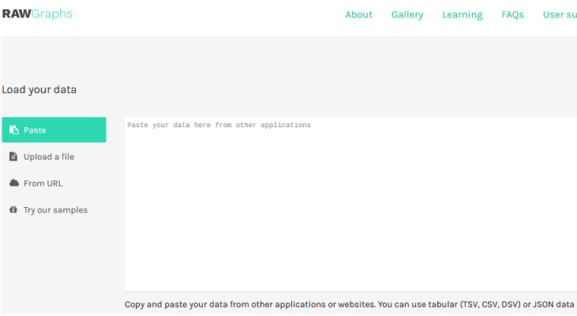
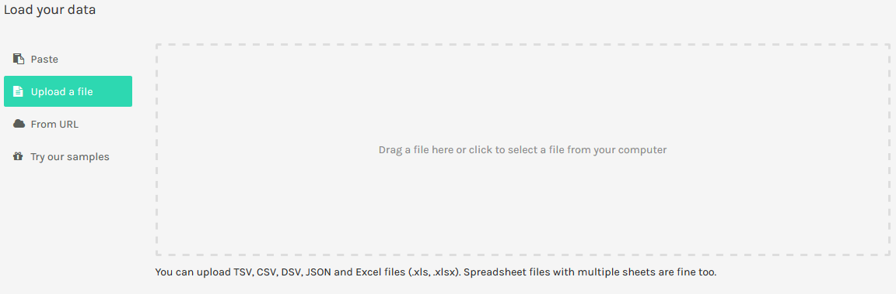
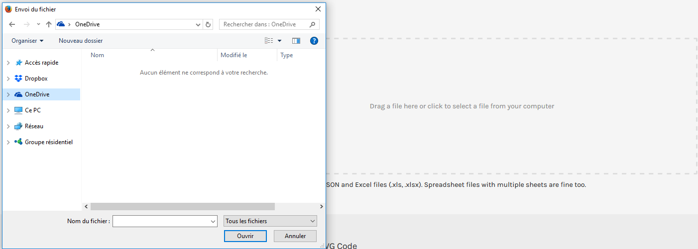
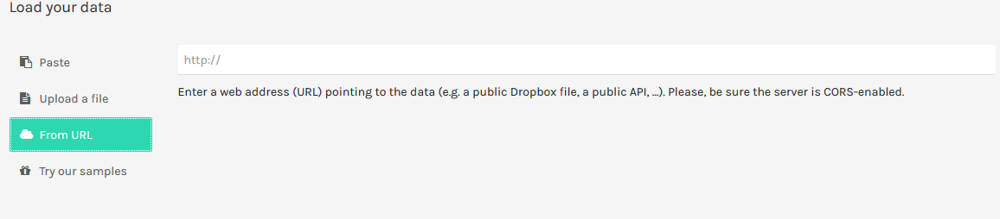
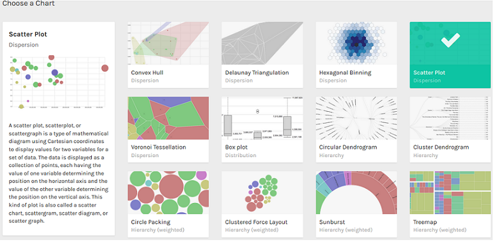
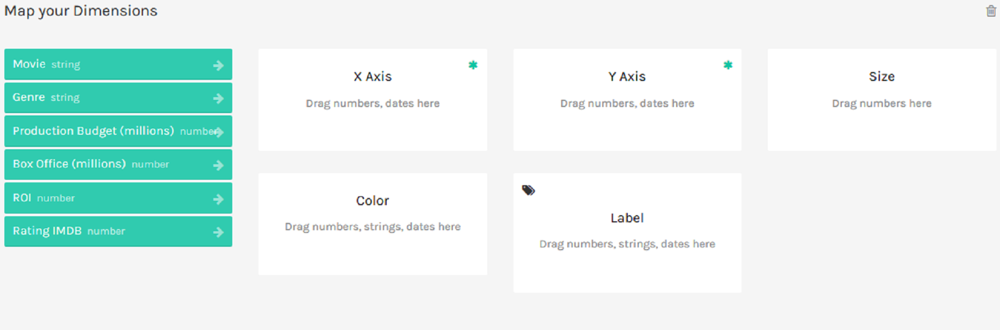
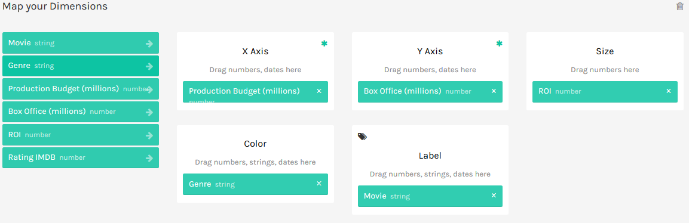
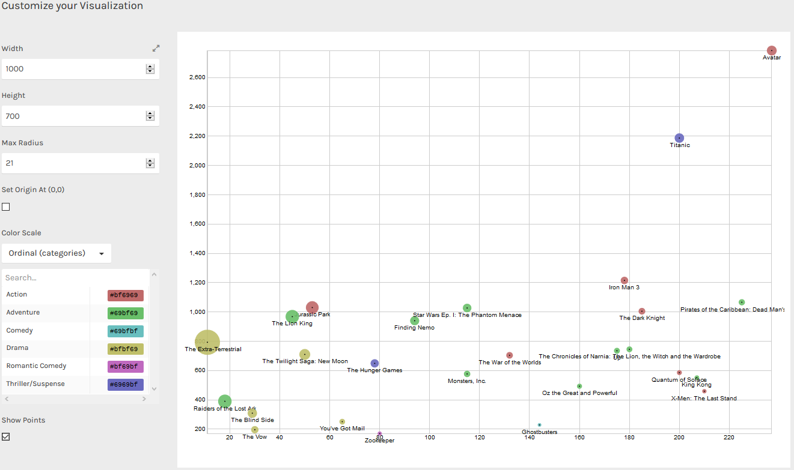
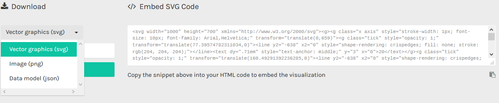

# Réaliser un datavisualisation avec Raw Graphs

- **Niveau** : Débutant / **Intermédiaire** / Avancé / Expert 

- **Auteur** : Frédéric Kingué Makongué 

- **Date de MàJ** : 16/11/2017

- **Licence** : Creative Commons by Frédéric Kingué Makongué SA

## Principes - Ce que nous allons faire

Effectuer une représentation graphique des données avec Raw Graphs

## Ingrédients - Ce dont nous avons besoin

- Une connexion internet

- Un jeu de données

- Un tableur en local ou en ligne (Calc de Libre Office, Excel de MS Office, Google Sheets de Google Drive)

## Etapes - Comment allons-nous procéder ? 

Aller sur le site de Raw Graphs dont voici le lien : [Raw Graph](http://app.rawgraphs.io/)

Sur la page d’accueil deux options sont proposées :

Soit intégrer un jeu de données de son choix soit charger un jeu de données déjà pré-enregistré en utilisant la fonction appelée Try our simples

Il existe trois manières d’intégrer le jeu de données de son choix à l’application. 

Pour utiliser la fonction appelée Paste. Copiez et collez le tableur dans le rectangle blanc dans lequel est inscrit la phrase « Paste your data here from other applications » 

Pour utiliser la fonction appelée Upload a file. Cliquez sur le bouton Upload a file.

Une fois cette action effectuée. Cliquez dans le rectangle gris dans lequel est inscrit la phrase "Drag a file here or click to select a file from your computer" pour ouvrir une boîte de dialogue.

Une fois la boîte de dialogue ouverte, utilisez l'explorateur de fichiers afin de sélectionner le fichier désiré

Pour utiliser la fonction appelée From URL. Cliquez sur le bouton From URL. 

Après cela copiez puis collez l'adresse URL du jeu de données.

Pour illustrer ce cas pratique, j’ai choisi d’utiliser un jeu de données pré-enregistré sur l’application. 

J’ai choisi le jeu de données s’intitulant Movie.

Une fois le jeu de données intégré à l'application.

Choisir le type de datavisualisation souhaité parmi les différents choix disponibles.

Pour représenter Movie, j’ai choisi une datavisualisation nommée Scatter Plot qui permet de représenter un nuage de points. 

Scatter Plot permet d'afficher la relation entre deux variables numériques d'une série ou de plusieurs séries.

Un nuage de points indique le degré de corrélation entre deux ou plusieurs variables liées. Chaque unité représente un point dans le nuage. Pour obtenir un nuage de points il est indispensable d'avoir au moins deux variables de valeurs numériques.
L'une des variables verra ses valeurs représentées sur l'axe des abscisses appelé ( X Axis). L'autre variable verra ses valeurs représentées sur l'axe des ordonnées appelé (Y Axis).

Choisissez les deux différentes variables de votre jeu de données à analyser en fonction des deux axes cités précédemment. 
Faites glisser les rectangles verts reprennant l'intitulé des variables dans les rectangles blancs en fonction des paramètres souhaités. 
Le nuage de points peut être personnalisé par l'utilisateur en attribuant une couleur, un nom ou une taille aux différents points.

Une fois ces paramètres définis le graphique désiré apparait 

Redimensionner votre graphique en changer les paramètres grâce champs proposés sous la phrase "Customize your visualization"

Dans mon exemple Width permet de régler la largeur du graphique, Height sa hauteur et Max Radius taille des points. 

Une fois le graphique réalisé, deux options sont possibles.

Télécharger le grahique en fonction du fomat de fichier souhaité. 

Appuyez sur le bouton "Download". 

Ou 

Copiez le code SVG du graphique afin de l'intégrer directement un document HTML, JavaScript ou CSS. 

## *Liens avec d’autres fiches :*

Qu’est-ce que la visualisation de données ? 
