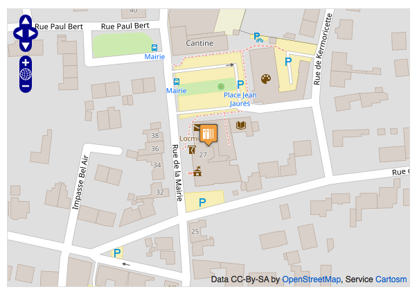
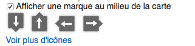
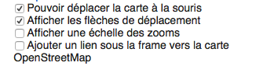
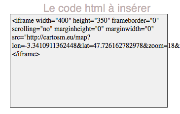

# Ajouter une carte OpenStreetMap sur un site internet grâce a CartOSM

**Niveau** : **Débutant**/Intermédiaire/Avancé/Expert
**Auteur** : LP MIND
**Date de maj** : 12/11/2017
**Licence** : CC-BY

## Principe

OpenStreetMap met à disposition des cartes qui peuvent être intégrées sur un site Internet à travers le service en ligne CarteOSM, développé par Rodolphe Quiédeville. Le service en ligne, totalement dépendant d’OpenStreetMap, est gratuit et très simple à utiliser.

##Ingrédients##

- Un ordinateur, une souris, un clavier et un écran fonctionnel.
- Un accès à internet et un navigateur utilisable.
- Pour intégrer une carte à un site, il convient d’avoir un site internet.
- En général si vous consultez cette recette c’est que la plupart des ingrédients sont déjà présent.

##Etapes - Procédure##
-Rendez vous sur le site [cartons](http://cartosm.eu/)

-Positionnez vous grâce à la barre de recherche à droite ou en bougeant sur la carte.

-Vous pouvez afficher un icône au milieu de la map grâce à l’option se trouvant à droite.

- D’autres options sont possible et vous pouvez ainsi choisir de déplacer la carte avec la souris, d’afficher l'échelle d’un zoom ou de régler la taille de la carte.

-Une fois la carte comme voulue, il suffit de copier le code Html en le sélectionnant>clic droit souris> copier

-Accéder ensuite à votre site internet et insérez ce code en mode texte sur vos articles.

##En Savoir Plus##

##Fiche en Lien##

##Aller plus Loin##
